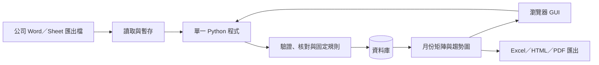

# EM MVP：GUI 可行性、技術債與多人擴充

日期：2026-10-01｜狀態：PM 建議方案，尚未實作或部署

本文件以使用者新增的「GUI 讀 Word、產出每月視覺化、未來可能多人使用」為前提。原 Excel／VBA 規格保留為比較基準；匯入核對、人工修正、來源追溯、固定規則及既有 CRR／點位矩陣要求繼續適用。

## 1. 建議決策

採用**本機瀏覽器 GUI＋單一 Python 程式＋本機資料庫**。第一版從 Windows 電腦啟動，瀏覽器操作，資料不需送到外部服務。未來把同一程式部署到公司內網，使用者以網址操作。

Excel／Google Sheet 保留作為匯入、匯出與人工核對工具；系統資料庫是唯一正式寫入來源。不平行維護 GUI 與 VBA 的兩套判定引擎，不做 Excel／Sheet 雙向同步。

GUI 本身不要求換技術：VBA 也可做 UserForm。選擇瀏覽器 GUI 的理由是集中資料、延續既有 Python 解析程式，以及降低未來多人使用時的介面重寫成本。

這是架構與開發方向建議，並非已交付可用 GUI。程式包能否在公司電腦執行、真實 Word 解析正確率及資料庫轉移仍須實測。

## 2. 三種方式比較

以下是針對目前需求的相對判斷，不是工時、價格或效能量測。

| 比較項目 | Excel＋VBA／UserForm | Python 桌面 GUI | Python 瀏覽器 GUI（建議） |
|---|---|---|---|
| 第一版操作 | 同仁熟悉 Excel，容易上手 | 程式視窗、選檔、表單 | 瀏覽器選檔、核對表、查詢及圖表 |
| Word 讀取 | 可透過 Word COM；依賴 Office，需處理程序及例外 | 可直接解析 .docx | 同桌面版，解析在程式端 |
| 沿用現有程式 | 既有 Python 邏輯須轉寫或外接 | 可沿用並整理既有 Python | 可沿用並整理既有 Python |
| 人工修正 | 多列貼上方便；直接改儲存格可能繞過歷程 | 需做修正表單及操作便利性 | 需做修正表單及操作便利性 |
| 月份趨勢 | 原生圖表熟悉，須維護範圍及公式 | 圖表及查詢可統一管理 | 圖表及查詢可統一管理，方便多人查看 |
| 資料一致性 | 備份、歷程、重複與整批回復需自行實作 | 資料庫可提供約束與交易 | 同桌面版；所有写入集中由程式處理 |
| 部署負擔 | 巨集政策、Office 版本、工作簿版本 | 安裝／程式包、套件版本、Windows 測試 | 本機啟動程式包；多人版需服務與 IT 維運 |
| 多人擴充 | 共用檔不足；需要改後端及寫入方式 | 需新增伺服器連線，可能重做介面 | 原畫面與業務邏輯可保留；增加集中部署、身分及權限 |
| 技術債重點 | 公式／巨集與資料耦合、版本副本、多人改造 | UI 與本機資料耦合、各電腦更新 | 套件更新、服務部署、登入安全、資料庫移轉 |
| 適合條件 | 長期單人、Office 為唯一允許平台 | 確定單機且需要桌面整合 | 單人起步，但預期後續多人 |

GUI 不會自動提升 Word 的辨識正確性。兩種技術都必須有版型契約、原始文字保留與人工核對。

## 3. 最小架構

建議使用 Flask＋Jinja 的表單／表格頁面，SQLAlchemy 管理資料庫讀寫，沿用現有 Python Word 擷取邏輯；圖表使用一個固定的本機隨附圖表套件。先採 Chart.js 呈現折線與柱狀圖，資料由同一報表計算結果供應，不依賴 CDN。

先維持少量功能模組：GUI 路由／表單、Word／Sheet 匯入、資料庫、驗證／規則、報表。畫面不能直接改資料庫；所有提交與修正都通過同一驗證及交易流程。不新增 React、微服務、外掛框架或通用規則語言。

正式本機使用也須以適當的 WSGI server 啟動（Windows 可評估 Waitress），關閉 debug，預設只監聽 127.0.0.1。Windows 啟動程式包要實測啟停、埠占用、中文字型與公司執行政策；不能把 Flask 開發伺服器当正式交付。

## 4. 操作畫面與月報

首版四個區域即可：

1. **匯入**：選 Word 檔／指定範圍資料夾、讀 Sheet 匯出 XLSX，顯示成功、待核對、未知版型與錯誤數。
2. **核對／修正**：原文、來源表列、抽取值與判定並列；按選取列修改並填原因；核對後整批提交。
3. **查詢**：月份／期間、廠別、監測類型、方法、點位或人員；能回查原始報告。明細匯出供大量人工核對，首版不承諾完整 Excel 式多格編輯。
4. **月報／趨勢**：既有人員 CRR、點位採樣矩陣，加上按月折線／柱狀圖及匯出。

報表保留既有定義：人員 CRR 以廠別＋日期＋人員去重，落菌／接觸合併；點位表以實際採樣數計算；Isolator 獨立分組，缺操作者不推入人員分母。報告事件與人日是不同資料粒度。

初版視覺化：人員 CRR%／月（附陽性人日及總人日）、同方法／單位／条件的點位 CFU 月彙總與採樣數、陽性或 Action 比率／月（附分子分母）。不同方法不相加為通用 Total CFU，無資料月份為斷點，不補 0。歷史門檻線依有效日期選取限值，不能拿今日限值重畫成整段歷史標準。

數字摘要由固定計算輸出；QA 說明保留人工欄位。首版不產生 AI 趨勢解釋。已保存報告是附資料／規則版本的快照；GUI 查詢畫面則隨資料重新計算，兩者明確標示。

## 5. Word 可行性與已存在的技術債

本地已有 .docx 表格擷取程式，包含文字、橫向跨度與縱向合併資訊；另有例行環測抽欄原型及 Sheet／CRR 聚合程式。因此 Python GUI 有可用的既有基礎，但不是直接包上畫面就完成。

已看到的具體限制：

- 部分原型固定年份、檔案路徑及欄位位置；改成明確來源設定、版型識別與欄名映射。
- 部分數值處理只取文字中第一個數字；不能直接用於 TNTC、不等式、附註或多數值結果。按結果類型與版型處理，不明內容送人工核對。
- 表格合併、勾選符號、版型改版與缺列會影響對應；需保留来源位置并對帳來源列數與入庫列數。
- .docx 表格可直接解析；舊 .doc、掃描圖片、受密碼保護或未支援結構先列人工處理／格式轉換，不讓未知內容進正常結果。

這些是兩種 GUI 都要解決的共同技術債，優先於美化 Dashboard。

## 6. 多人擴充：現在要做與後續再做

現在即建立：穩定 record_id、來源指紋及版本、來源多對一關聯、created_by／updated_by、record_version、修正原因及前後值、匯入批次、唯一／外鍵約束、資料庫 schema 版本與可重複執行的移轉程序。修正與歷程同一交易，失敗整批回復；重匯入不覆蓋人工修正。本機版也須對所有寫入檢查 CSRF token，限制允許的 Host／Origin，驗證檔案大小、格式與可讀來源路徑，不能只靠監聽 127.0.0.1。

單人階段的操作者紀錄可使用明確標示的本機身分，不能宣稱是經認證簽署。權限檢查應集中在寫入操作，避免未來每個畫面各自補上判斷。

多人啟用前完成：

- 公司內網主機集中執行；使用者瀏覽器連線，Word 路徑由伺服器權限讀取，或使用者上傳檔案。瀏覽器不能任意讀客戶端磁碟／資料夾路徑。
- 經認證帳號、輸入／審閱／管理角色、HTTPS 與伺服器端權限檢查、集中來源檔權限；延續本機版 CSRF 與輸入驗證。
- 修改時比對 record_version：第二個人提交舊版本要提示衝突，不默默覆蓋。批次寫入也要檢查，不只單筆 ORM 更新。
- 集中備份、還原演練、來源報告保存及服務啟停維運。長批次若會阻塞互動，再新增持續化的匯入工作與進度；第一版不先導入 Celery／Redis。
- SQLite→PostgreSQL 移轉並核對明細、來源關聯、歷程、日期、唯一鍵與月報結果。ORM 不代表更換連線字串就完成移轉。

資料庫建議：第一版單人、本機非同步磁碟用 SQLite；透過程式備份取得一致快照。程式碼可在目前專案版本管理，執行中的資料庫不得放 OneDrive／Google Drive 同步資料夾、USB 隨身碟或網路共享路徑。Word 原檔可以位於有權限的公司共享資料夾。

未來小量多人若由同一伺服器存取且寫入少，server-local SQLite 仍可能適用；常態多人編輯建議 PostgreSQL。若多人上線已排定或 IT 已提供資料庫，第一版直接 PostgreSQL 能省去一次移轉，但多出設定、服務與備份管理負擔。

## 7. 技術債清單與處理時機

| 技術債 | 若忽略會發生什麼 | 建議時機 |
|---|---|---|
| Word 版型與結果語义 | 欄位錯位、數字誤讀仍生成好看的報表 | 第一個真實資料切片即處理 |
| 身分與資料粒度 | Word／Sheet 雙計、樣本與人日分母混用 | 第一版資料模型即處理 |
| 人工修正及重匯入 | 新匯入覆蓋已核對值 | 第一版即處理 |
| 資料庫移轉與 schema 版本 | 日後資料轉不動或丟失關聯 | 現在保留移轉程序；多人上線前演練 |
| 併發修改 | 後提交者蓋掉先提交者 | 現在加版本欄位；多人前測兩人同改 |
| 執行包與套件版本 | 換電腦失敗、套件更新影響解析 | 首次 Windows 試行即固定版本與測啟動 |
| 登入、權限及服務維運 | 程式可開啟但無法安全供多人工作 | 內網開放前完成，不隨 MVP 默認具備 |
| Excel 大量編輯便利性 | GUI 逐筆修正太慢 | 首版以明細匯出核對＋選列修改；實測後決定批量修正功能 |
| 報告快照與目前畫面 | 修正後仍引用舊圖或舊數字 | 第一版標示截止時間及版本 |

相對評估：VBA 初期啟動負擔較小，但預期多人時遷移債較大；瀏覽器 GUI 初期多出部署及套件管理，能保留較多介面與核心程式。兩者都需要懂程式的維護者；沒有無維護成本的方案。

## 8. 更新後第一個開發切片

選一個月份、一廠、一種已知 Word 版型，使用 Word＋對應 Sheet 匯出，完成「GUI 匯入→核對→資料庫→既有兩張矩陣」。先用已核對來源驗證，不能把旧輸出當成原始資料。

一個月份只能驗證擷取、分母與彙總；趨勢圖另用至少三個連續、可取得的真實月份驗證。每月樣本數、CFU、小計與人日 CRR 逐項對帳，再測缺資料月份、人工修正重算、重匯入與來源衝突。

該切片還要測：未知版型攔截、0 與空白分離、備份及還原、模擬寫入中斷、舊版本修正衝突、另一部公司 Windows 電腦啟動。多人版另設帳號權限與同時提交驗收，不以單人測試代替。

## 9. 參考專案的用途

[REFERENCE-PROJECTS.md](REFERENCE-PROJECTS.md) 記錄兩個 GitHub 專案實際審查結果。thewaterloo 借用摘要／限值／異常清單／月報的分工；alyce 借用按方法、房間及日期查看 CFU 的圖表構想。自行實作，不引入 R 作執行依賴，不照搬示例限值或模擬資料。既有 CRR／點位矩陣仍是核心驗收基準。

## 10. 官方技術依據

- [Word 表格合併／缺格／巢狀結構](https://python-docx.readthedocs.io/en/latest/user/tables.html)：解釋版型解析為何需要核對。
- [Flask 正式部署](https://flask.palletsprojects.com/en/stable/deploying/)：正式本機與內網使用都不採開發伺服器。
- [Flask Web 安全](https://flask.palletsprojects.com/en/stable/web-security/#cross-site-request-forgery-csrf)：本機版寫入亦需跨站請求防護。
- [Waitress 支援 Windows](https://flask.palletsprojects.com/en/stable/deploying/waitress/)、[Chart.js 圖表](https://www.chartjs.org/docs/latest/)：本機服務與瀏覽器圖表的建議依據。
- [SQLAlchemy 資料庫支援](https://docs.sqlalchemy.org/en/20/dialects/index.html)、[版本欄位與限制](https://docs.sqlalchemy.org/en/20/orm/versioning.html)：支援資料庫介接與舊值更新檢查，但批次更新須另處理。
- [SQLite 網路檔案限制](https://www.sqlite.org/useovernet.html)：集中程式存取與共用資料庫檔案不同。
- [Windows 程式封裝](https://pyinstaller.org/en/stable/operating-mode.html)：可封装 Python 與依賴，仍要在目標 Windows 環境驗證。
